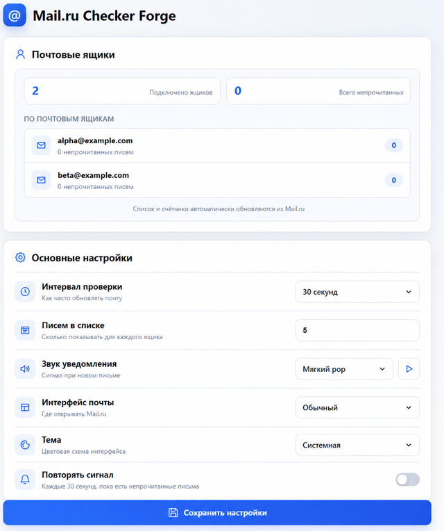
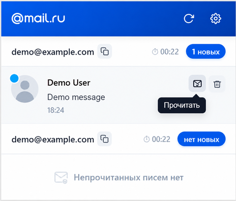

# Mail.ru Checker Forge

Расширение для **Google Chrome и Mozilla Firefox**, которое показывает непрочитанные письма Mail.ru прямо в панели браузера. Поддерживает несколько почтовых ящиков, уведомления и быстрые действия с письмами.

Форк [Mail.ru Checker Free](https://chromewebstore.google.com/detail/mailru-checker-free/npehpdcondlmfhfhhfmpoiomoalhkfdf). Обе версии развиваются в одном репозитории и используют общие исходники.

## Скачать

[Последний релиз](https://github.com/numbereleven-a/Mail.ru-Checker-Forge/releases/latest)

| Браузер | Архив версии 1.0.4 | Установка |
| --- | --- | --- |
| Chrome 120+ | [Скачать для Chrome](https://github.com/numbereleven-a/Mail.ru-Checker-Forge/releases/download/v1.0.4/Mail.ru-Checker-Forge-Chrome-1.0.4.zip) | Распакованное расширение |
| Firefox 142+ | [Скачать для Firefox](https://github.com/numbereleven-a/Mail.ru-Checker-Forge/releases/download/v1.0.4/Mail.ru-Checker-Forge-Firefox-1.0.4.zip) | Тестовая сборка, временное дополнение |

Firefox: подпись Mozilla и публикация в каталоге пока не выполнены. Временное дополнение удаляется после перезапуска браузера.

## Возможности

- Счётчик непрочитанных писем на значке расширения.
- Письма из нескольких подключённых ящиков в одном окне.
- Открытие ящика или письма одним нажатием.
- Быстрые действия: пометить письмо прочитанным или переместить в «Корзину».
- Уведомления и восемь звуков с предпрослушиванием.
- Настраиваемый лимит от 1 до 100 писем для каждого ящика; по умолчанию — 5.
- Светлая, тёмная и системная темы.
- Сохранение локального состояния писем для каждого ящика.

## Скриншоты

<p align="center"></p>
<p align="center"></p>

## Установка в Chrome

1. Скачайте архив с **Chrome** в имени и распакуйте его в отдельную папку.
2. Откройте `chrome://extensions/` и включите «Режим разработчика».
3. Нажмите «Загрузить распакованное расширение» и выберите папку с `manifest.json`.
4. Откройте Mail.ru в этом же профиле Chrome и войдите в нужные ящики.

Сохраняйте распакованную папку на диске: Chrome использует её файлы.

## Временная установка в Firefox

1. Скачайте архив с **Firefox** в имени и распакуйте его в отдельную папку.
2. Откройте `about:debugging#/runtime/this-firefox`.
3. Нажмите «Загрузить временное дополнение» и выберите `manifest.json` из этой папки.
4. Разрешите доступ к сайтам Mail.ru, если браузер запросит его.
5. Войдите в нужные ящики Mail.ru в обычных вкладках этого же Firefox.

Не выбирайте манифест из корня исходников: он предназначен для Chrome. После перезапуска Firefox временную сборку потребуется загрузить заново. Для постоянной установки необходима подпись Mozilla.

Firefox не поддерживает кнопки внутри системных уведомлений. Нажатие на уведомление открывает письмо; быстрые действия доступны в окне расширения. Настройки и сессии Chrome автоматически не переносятся. Ящики в контейнерах Firefox и приватных окнах отдельно не поддерживаются.

[Подробнее о Firefox](FIREFOX.md).

## Настройки

Откройте окно расширения и нажмите шестерёнку:

- интервал проверки: 30 секунд, 1, 3 или 5 минут;
- количество писем для каждого ящика: от 1 до 100;
- звук уведомлений: восемь вариантов или отключение; по умолчанию — «Мягкий pop»;
- повтор сигнала каждые 30 секунд, пока есть непрочитанные письма — включается отдельно;
- обычный или мобильный интерфейс Mail.ru;
- светлая, тёмная или системная тема.

## Разрешения и данные

- `storage` — настройки и локальное состояние писем;
- `notifications` — уведомления;
- `alarms` — периодическая проверка;
- `idle` — пауза проверки при простое или блокировке компьютера;
- `offscreen` — фоновый звук в Chrome; Firefox использует фоновую страницу;
- доступ к указанным доменам Mail.ru — список ящиков, счётчики и действия с письмами.

Расширение использует существующую сессию Mail.ru в браузере и не запрашивает пароль. Firefox при установке показывает категории данных, необходимые для работы с Mail.ru: адреса ящиков, сведения авторизации и данные писем. [Политика конфиденциальности](privacy.html).

## Сборка и проверка

Требуется Node.js. Обе сборки создаются командой:

```text
node scripts/build.js
```

Результат: отдельные папки `artifacts/<версия>/chrome` и `artifacts/<версия>/firefox`, где версия берётся из `manifest.json`. Для одного браузера используйте `node scripts/build.js chrome` или `node scripts/build.js firefox`. Перед повторной сборкой переместите предыдущую папку результата.

Для создания ZIP упакуйте содержимое нужной папки: `manifest.json` должен находиться в корне архива.

```text
node tests/regression.js
node tests/review.js
```

Тесты проверяют синхронизацию ящиков, действия с письмами, настройки, лимит списка, локальный кэш, обработку ошибок, напоминания, а также фоновые скрипты, звуки и уведомления Firefox. Автотесты используют тестовые данные; работу с почтой можно проверить после авторизации в браузере.

## Исходники

- `background.js` — опрос почты, уведомления и фоновая логика;
- `popup.html`, `js/popup.js` — окно расширения;
- `options.html`, `js/options.js` — настройки;
- `offscreen.html`, `offscreen.js` — звук в Chrome;
- `manifest.json` — исходный манифест Chrome;
- `scripts/build.js` — подготовка сборок Chrome и Firefox;
- `tests/regression.js` — регрессионные проверки;
- `tests/review.js` — проверки запоздалых ответов, кэша, Unicode и создания звукового документа;
- `tests/browser-smoke.js` — проверка готовой папки расширения в отдельном профиле Chrome или Firefox с тестовыми письмами.

## Лицензия

Проект распространяется по лицензии [MIT](LICENSE).
